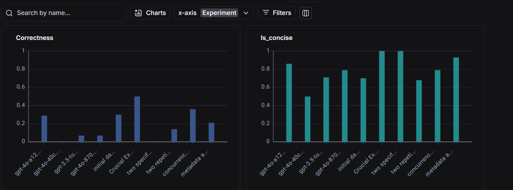
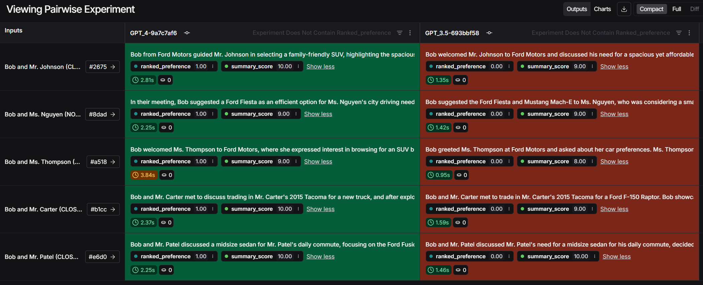
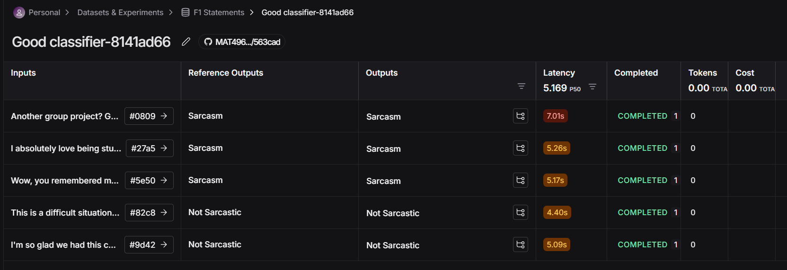
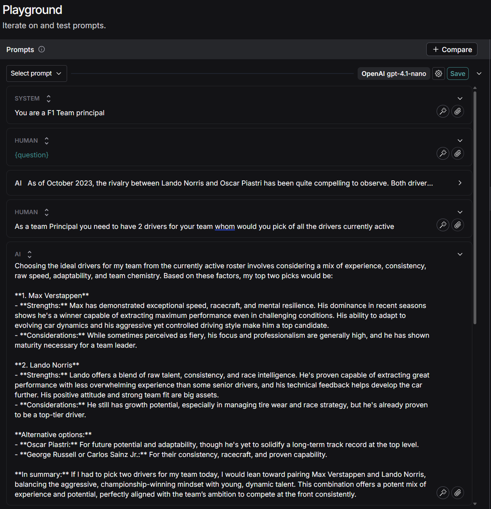
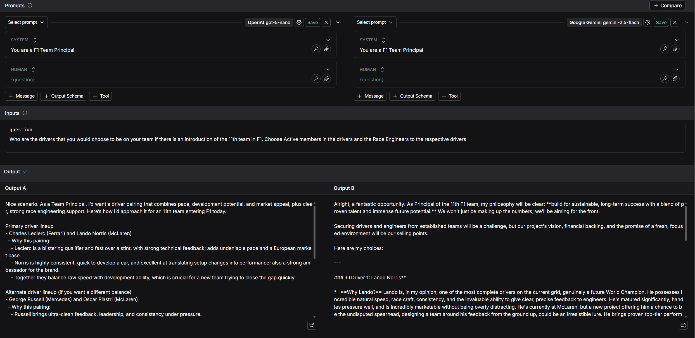
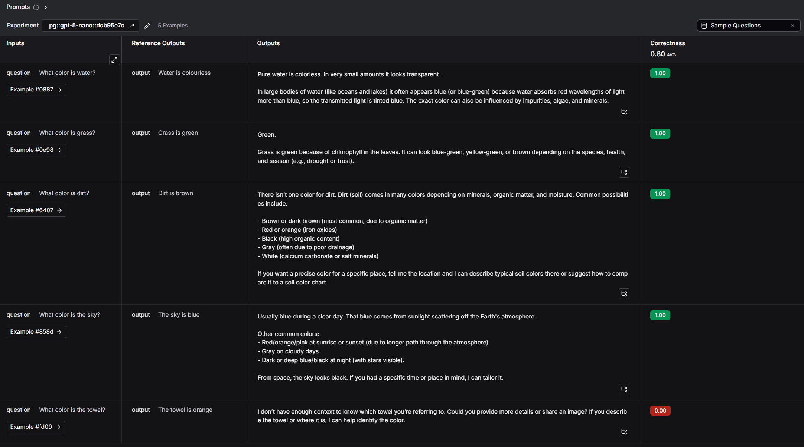

# Module 1

* In video 1 it explained about what is tracing and the importance of tracing as it helps in easily seeing where the code is actually struggling in a pictorial manner
---
* In video 2 it was explained abt the different running methods and how their outputs were rendered but it seems that the difference in rendering has been reduced these days
* * It explained abt the LLM, Chain, Tool and Retriver runtype
---
* In video 3 we saw abt a few different methods for doing the tracing other than the traceable annotation
  * We saw that instead of the traceable annotation we used
    * trace method 
    * the langraph which had an inbuilt tracing method that was set in the env
    * using <b>wrap_openai</b> that automatically tracks each call done by the langchain 
    * Another method was the RUNTREE which was not explained a lot as they were more advanced
---
* In video 4 we say about how we can give thread id that would give us a look that it is similar to that of a actual chatbot where there are continuous chats based on previous chats asking questions
---

# Module 2

* In Video 1 what we did was we created datasets that have a question and gives an output for the given question
  * We did by sending the example data set thru the code
  * We also did by adding manually on the website
  * We did by AI generation
  
  * We used to split and to filter the examples 
  

---

* In video 2 we used a comparator that comes in with the Langchain modules that compare the preferred output with a sample output that we got by comparing and scoring them
  * These comparators are called as evaluators
  * We also tried by comparing manually on the langsmith UI website

---

* In video 3 we used experiments that can be used to test models and their accuracy by sending our question examples from our datasets
  * We used an auto comparator that we created in the LangSmith UI and made them check for correctness

---

* In Video 4 we analysed the experiment results that we had got from the previous video
  * We looked in into the various viewing filters that we could find
  

---

* In Video 5 what we did was we used LLM's to create summary from a given dataset of transcripts and what we asked the LLM to evaluate these scores and then asked to compare which model gave us the better summary and asked it to pick which summary is preferred
  
* This compared two models summaries and gave us the better one and told which it preferred

---

* In Video 6 we did a similar comparator where we had reference outputs and compared it to the outputs that were generated by the LLM model
  

---

# Module 3

* In Video 1 we explore the various features present in the playground option in the Langsmith UI
  * Here in the first section we gave the AI model a persona and told it to act like one
  
  * In the second section we take 2 different models and see how they respnd to the same prompt
  
    * We see that we used a GPT-5 model to compare against the Google Gemini Model and have seen the results
  * In the final section we used the playground to find the outputs
  
    * In this case I had also added an evaluator to evaluate itself rather than doing in a manual fashion
---

